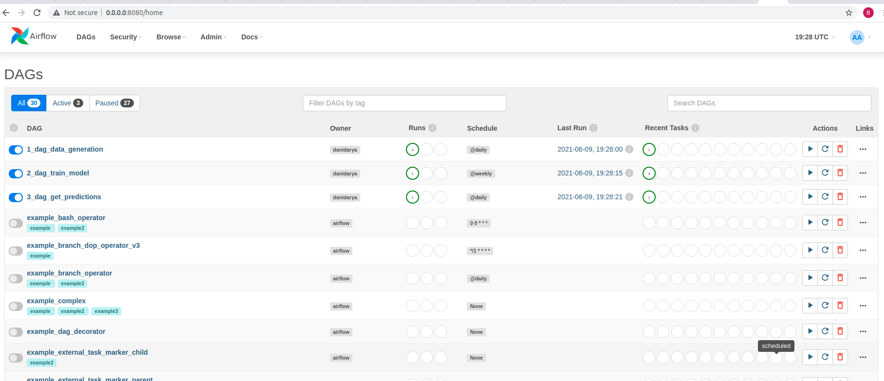
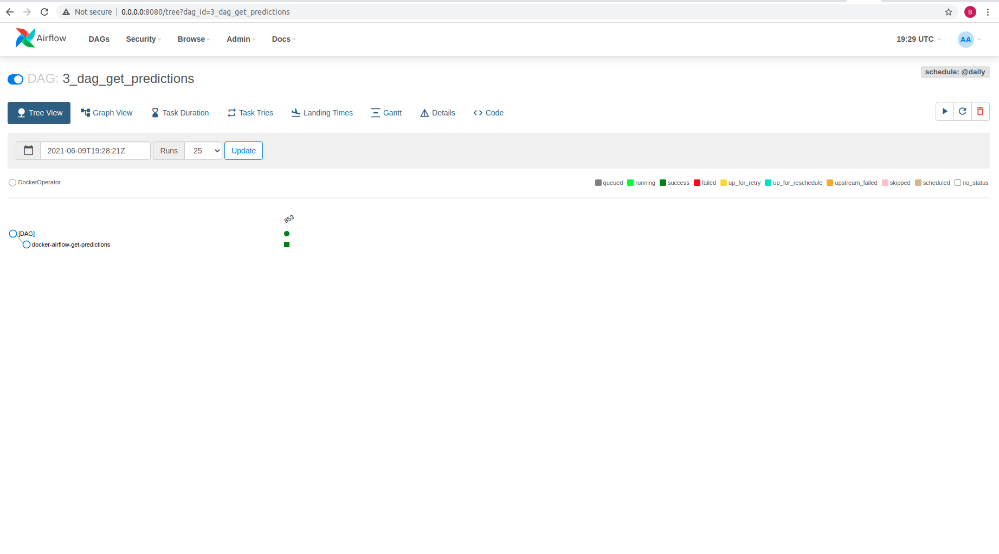

для корректной работы с переменными, созданными из UI (используется cозданная в GUI переменная model_path=/data/models/{{ds}}/model.pkl)
```
export FERNET_KEY=$(python -c "from cryptography.fernet import Fernet; FERNET_KEY = Fernet.generate_key().decode(); print(FERNET_KEY)")
docker compose up --build
```
Скриншоты:

Все даги



- dag_data_generation


- dag_train_model


- dag_get_predictions



